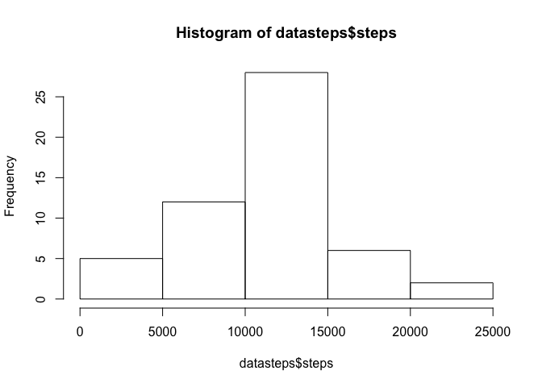
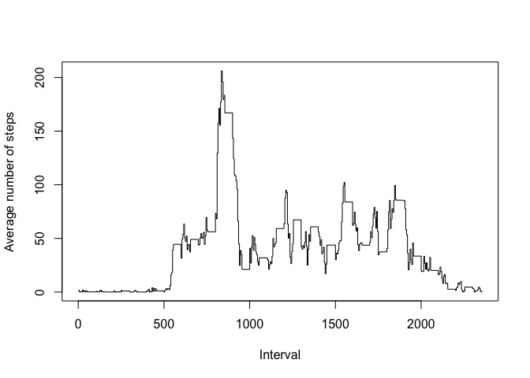
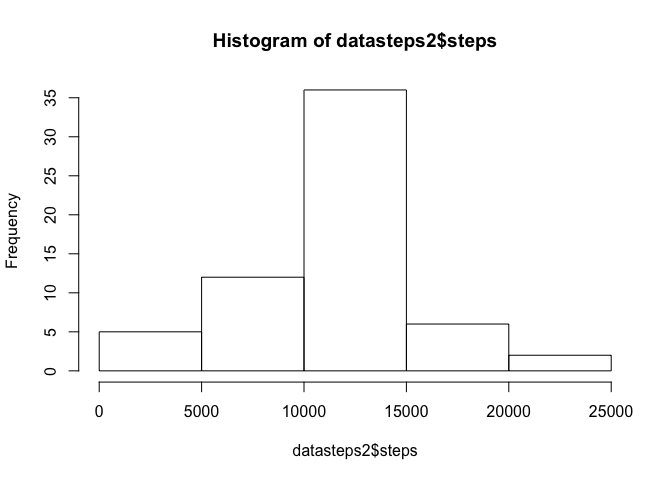

### Reproducible Research - Assignment 1

### Loading and preprocessing the data

### Set Directory

    dir <- setwd("~/CourseraData/RR")

### Get and save data to correct directory

    url <- "https://d396qusza40orc.cloudfront.net/repdata%2Fdata%2Factivity.zip"
    temp <- tempfile()
    download.file(url, temp, mode="wb")
    data <- read.csv(unz(temp, "activity.csv"))
    write.csv(data, "activity.csv", row.names=F)
    unlink(temp)

    library(knitr)

### What is mean total number of steps taken per day?

### Make a histogram of the total number of steps taken each day

    datasteps <- aggregate(steps~date, data=data, sum, na.rm= TRUE)
    hist(datasteps$steps)

<!-- -->

### Calculate and report the mean and median total number of steps taken per day

    datamean <- aggregate(steps~date, data=data, mean, na.rm = TRUE)
    datamedian <- aggregate(steps~date, data=data, median, na.rm = TRUE)

### What is the average daily activity pattern?

### Make a time series plot (i.e. type = "l") of the 5-minute interval (x-axis)

### and the average number of steps taken, averaged across all days (y-axis)

    steps.ts <- aggregate(steps ~ interval, data=data, FUN=mean)
    plot(steps ~ interval, steps.ts, type = "s",
           xlab = "Interval", ylab = "Average number of steps")

<!-- -->

### Which 5-minute interval, on average across all the days in the dataset,

### contains the maximum number of steps?

    steps.ts$interval[which.max(steps.ts$steps)]

    ## [1] 835

### Imputing missing values

### Calculate and report the total number of missing values in the dataset

### (i.e. the total number of rows with NAs)

    sum(is.na(data))

    ## [1] 2304

### Devise a strategy for filling in all of the missing values in the dataset.

### The strategy does not need to be sophisticated. For example, you could

### use the mean/median for that day, or the mean for that 5-minute interval, etc.

### Strategy is to replace NAs with the mean for each interval

### Create a new dataset that is equal to the original dataset but with the

### missing data filled in.

    library(plyr)
    impute.mean <- function(x) replace(x, is.na(x), mean(x, na.rm = TRUE))
    data2 <- ddply(data, ~ interval, transform, steps = impute.mean(steps))

### Used as a check for equation above

    intervalmean <- aggregate(steps~interval, data=data, mean, na.rm = TRUE)  

### Make a histogram of the total number of steps taken each day

    datasteps2 <- aggregate(steps~date, data=data2, sum)
    hist(datasteps2$steps)

<!-- -->

### Calculate and report the mean and median total number of steps taken

### per day.

    datamean2 <- aggregate(steps~date, data=data2, mean)
    datamedian2 <- aggregate(steps~date, data=data2, median)

### Do these values differ from the estimates from the first part

### of the assignment? What is the impact of imputing missing data on the

### estimates of the total daily number of steps?

### Answer: They do differ. As NAs are replaced with interval mean, the number of intervals that are in section of mean increases

### Are there differences in activity patterns between weekdays and weekends?

### Convert date to weekend/weekdays

    data2$day <- weekdays(as.Date(data2$date))
    library(timeDate)
    data2$week <- isWeekday(data2$date)

### Create a new factor variable in the dataset with two levels -- "weekday"

### and "weekend" indicating whether a given date is a weekday or weekend day.

    data2$dayend <- ifelse(data2$week == TRUE, "weekday", "weekend")
    data2$dayend <- as.factor(data2$dayend)

### Make a panel plot containing a time series plot

    library(lattice)
    final <- aggregate(steps ~ interval + dayend, data=data2, FUN=mean)
    xyplot(steps ~ interval | dayend, data=final, type="l", layout=c(1,2))

<!-- -->
